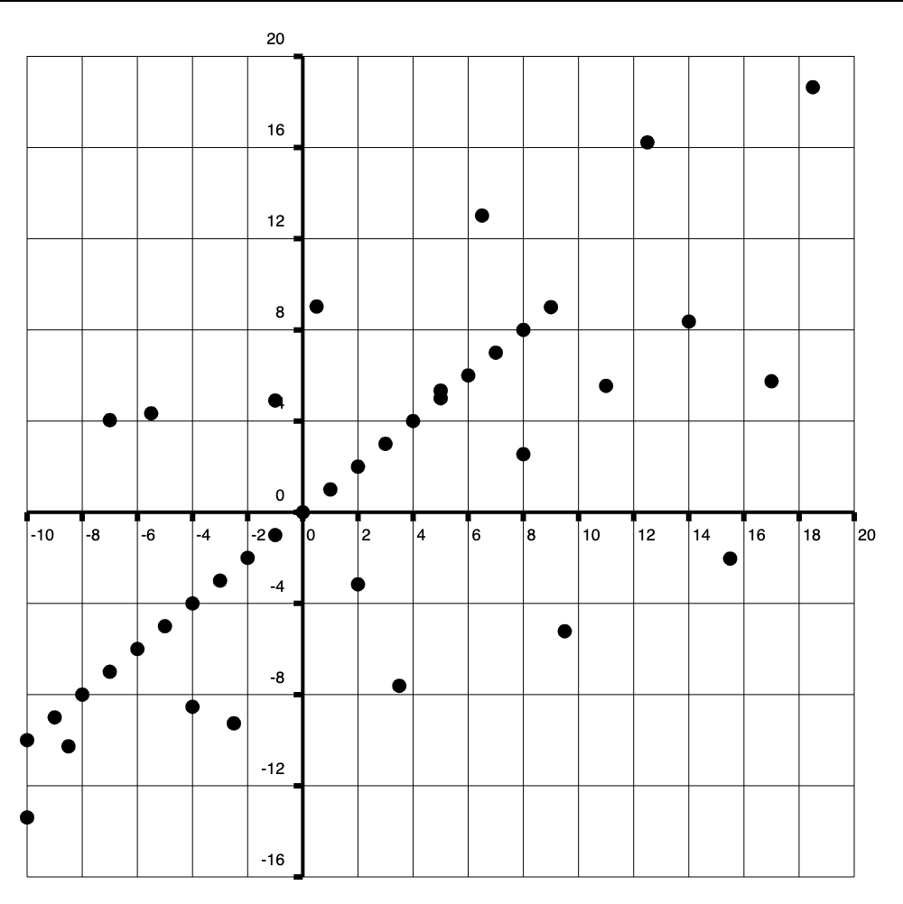
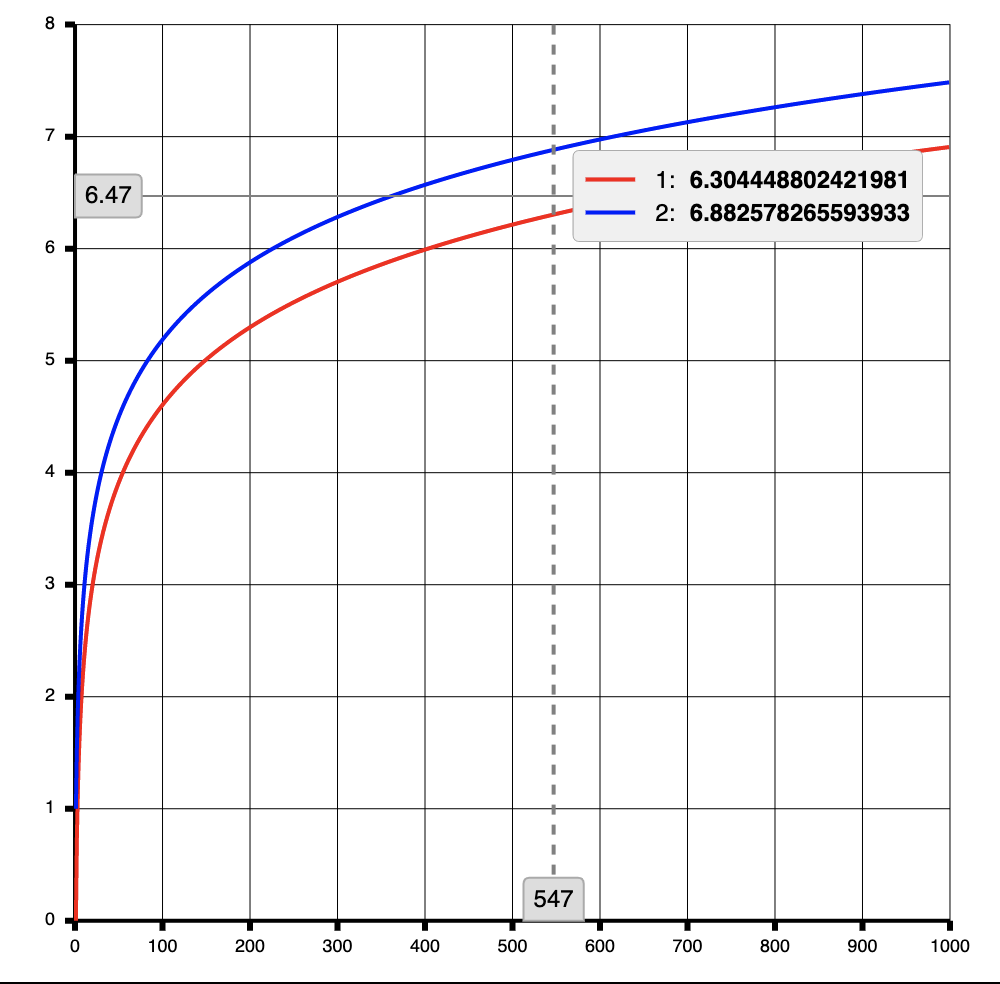
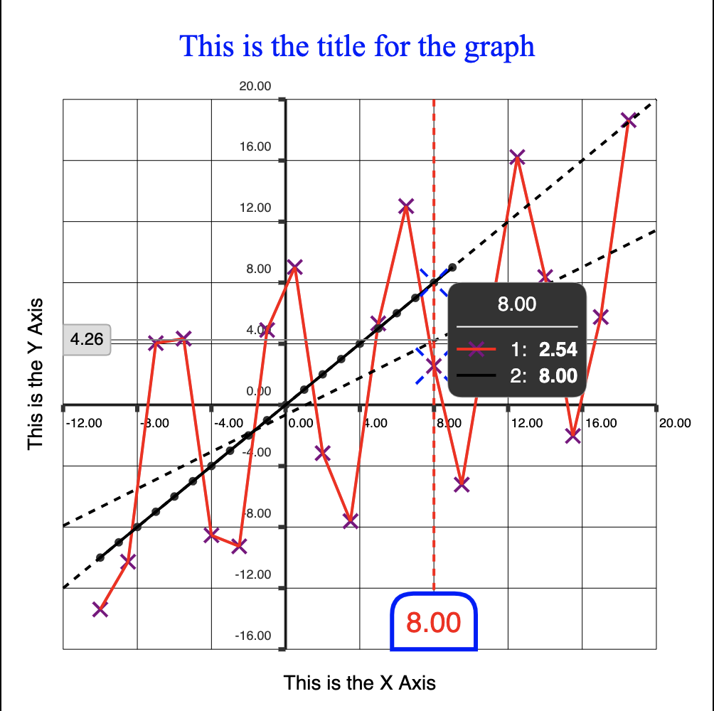
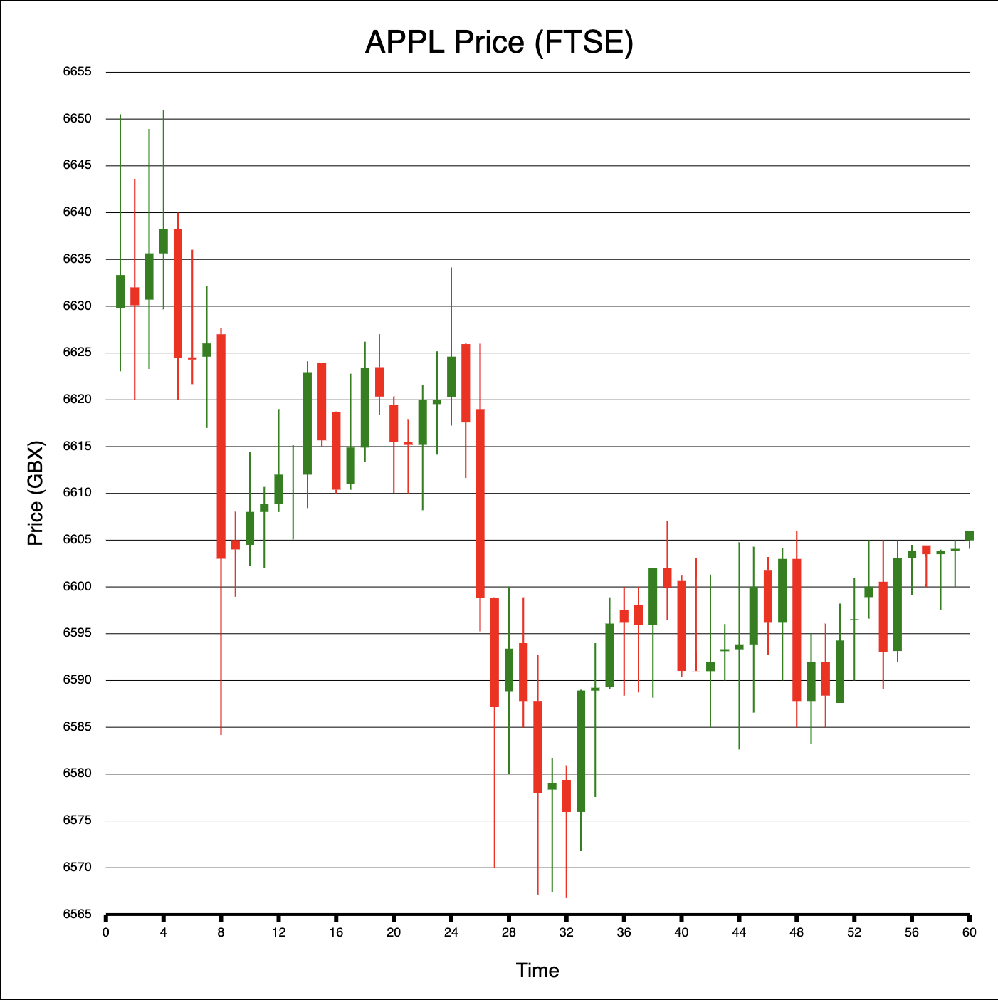
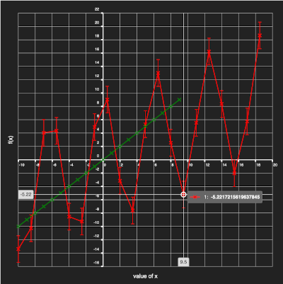

# Plot Pack

Data visualization package

## Graph

### Introduction

A chart component that is capable of rendering charts in a flexible and configurable way.

### Dependencies and Notable Technologies

* Canvas - For rendering the components.
* kd-tree-javascript - Efficient O(nlog(n)) nearest-neighbor searching
* core-js & @babel/polyfill - For polyfilling
* Typescript - The package is exclusively written in Typescript


### Usage

```jsx
import React from 'react'
import Graph from 'plot-pack/lib/components/graph'

export const MyComponent = () => (
  <>
    <h1>Example usage of Graph</h1>
    <Graph 
      height={height}
      width={width}
      title="f(x) = x^2"
      series={{
        1: [
          { x: 0, y: 0 },
          { x: 1, y: 1 },
          { x: 2, y: 4 },
          { x: 3, y: 9 }
        ]
      }}
    />
  </>
)

```

### Examples

#### Appearance with default options



#### Efficiently displays many points



#### Supports a high degree of customizability

...from the color and layout of the connecting line, markers, and tooltip:



...to being able to replace the marker rendering entirely:



...to dark mode:



# Contributing

## Introduction

plot-pack is not currently accepting contribution to the main line at the current time due to the early stage of the package. This will be reconsidered when the package has reached an appropriate level of maturity.

## Advised IDE Extensions

ESLint
