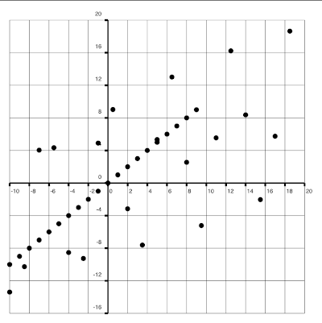
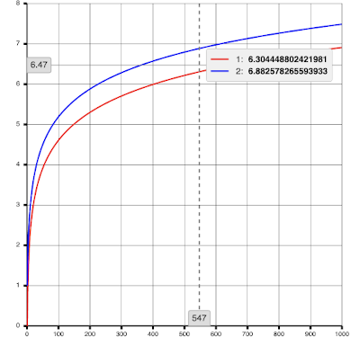
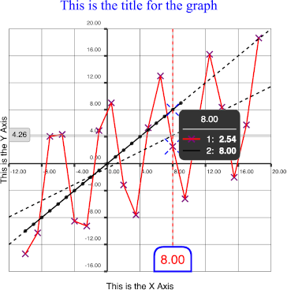
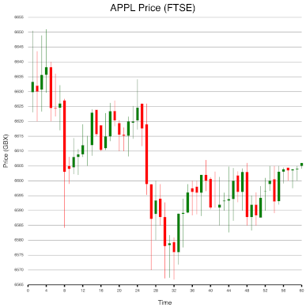
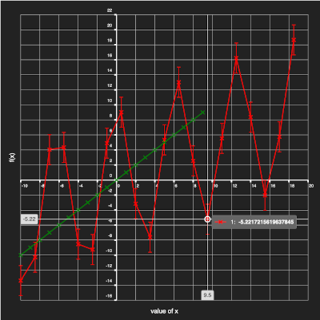

# Plot Pack

Javascript data visualization package.

This is currently an early work-in-progress project. Current drives:
* More documentation of usage
* More components
* Release builds
* More functionality and customizability

## Chart

### Introduction

A chart component that is capable of rendering charts in a flexible and configurable way.

### Dependencies and Notable Technologies

* Canvas - For rendering the components.
* kd-tree-javascript - Efficient O(nlog(n)) nearest-neighbor searching
* core-js & @babel/polyfill - For polyfilling
* Typescript - The package is exclusively written in Typescript

### Usage

```jsx
import React from 'react';
import { Chart } from 'plot-pack'
import { Axis2D } from 'plot-pack/lib/common/types/geometry';
import { NumberFormatNotation } from 'plot-pack/lib/common/types/math';
import MarkerType from 'plot-pack/lib/components/chart/types/MarkerType';

const datums = []
const fn = x => Math.sqrt(1000 - x**2) + 0.5
for (let i = -10; i < 10; i++)
  datums.push({ x: i, y: fn(i) })

function App() {
  return (
    <div className="App">
      <div style={{ width: '500px', height: '500px' }}>
        <h1>Chart:</h1>
        <Chart
          title="Math.sqrt(1000 - x**2) + 0.5"
          series={{ 1: datums }}
          axesOptions={{
            [Axis2D.X]: { notation: NumberFormatNotation.DECIMAL, numFigures: 0 },
            [Axis2D.Y]: { notation: NumberFormatNotation.DECIMAL, numFigures: 1 }
          }}
          markerOptions={{ size: 4, type: MarkerType.UPSIDE_DOWN_TRIANGLE, lineWidth: 1 }}
        />
      </div>
    </div>
  );
}

export default App;
```

### Examples

#### Appearance with default options



#### Efficiently displays many points



#### Supports a high degree of customizability

...from the color and layout of the connecting line, markers, and tooltip:



...to being able to replace the marker rendering entirely:



...to dark mode and error bars:



# Contributing

## Introduction

plot-pack is not currently accepting contribution to the main line at the current time due to the early stage of the package. This will be reconsidered when the package has reached an appropriate level of maturity.

## Publishing

`npm run build-tsc && npm version patch && npm publish`

## Advised IDE Extensions

ESLint
